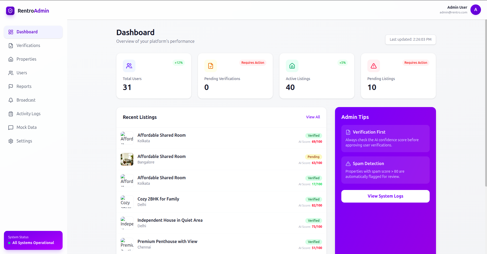
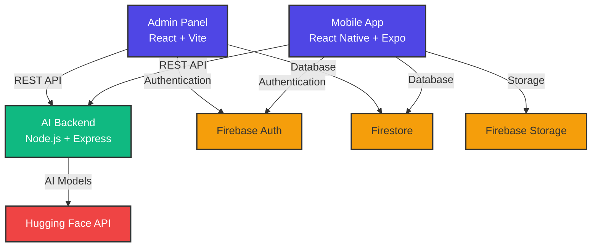

<div align="center">

# 🏠 Rentro

### Trust-Centered Rental Platform with AI-Powered Verification

*Building trust in rentals, one verification at a time*

[](https://opensource.org/licenses/MIT)
[](https://reactnative.dev/)
[](https://expo.dev/)
[](https://firebase.google.com/)
[](https://nodejs.org/)
[](https://tailwindcss.com/)

[Features](#-features) • [Quick Start](#-quick-start) • [Architecture](#-architecture) • [Documentation](#-documentation) • [Deployment](#-deployment)

---

</div>

## 🌟 What is Rentro?

Rentro is a **production-ready rental ecosystem** that revolutionizes trust and safety in property rentals through AI-powered verification systems. Built entirely with **FREE** resources, it combines cutting-edge AI with seamless user experience across mobile and web platforms.

### 🎯 The Problem We Solve

- 🚫 Fake property listings and scams
- 🤔 Unverified landlords and tenants
- 💬 Poor communication channels
- ⏰ Slow manual verification processes

### ✨ Our Solution

A three-tier platform featuring AI-powered spam detection, facial recognition verification, real-time chat, and comprehensive admin controls—all running on free-tier services.

---

## 🎨 Screenshots

<div align="center">

| 📱 Mobile App | 💻 Admin Panel |
|:---:|:---:|
|  |  |
| *Browse & Chat with Verified Owners* | *AI-Powered Verification Center* |

</div>

---

## ⚡ Features

<table>
<tr>
<td width="50%">

### 📱 Mobile App
- 🏘️ **Dual Role System** - Switch between tenant/owner modes
- 🔍 **Smart Search** - Filter by location, price, BHK
- 💬 **Real-time Chat** - Instant messaging with property owners
- ❤️ **Wishlist** - Save your favorite properties
- ⭐ **Reviews** - Rate and review properties
- 📸 **Multi-image Upload** - Showcase properties beautifully

</td>
<td width="50%">

### 🖥️ Admin Panel
- 📊 **Analytics Dashboard** - Real-time stats and metrics
- ✅ **Verification Center** - Side-by-side ID review
- 🤖 **AI Spam Detection** - Automated listing analysis
- 👥 **User Management** - Ban, unban, reset verifications
- 🏢 **Property Queue** - Approve/reject listings
- 📈 **Growth Tracking** - Monitor platform growth

</td>
</tr>
</table>

### 🤖 AI-Powered Intelligence

<details>
<summary><b>🛡️ VeriSentry - Trust & Safety Agent</b></summary>

- **Spam Detection**: Analyzes property descriptions for scam patterns
- **Image Verification**: Matches property photos with descriptions
- **Face Recognition**: Compares ID cards with live selfies
- **Trust Scoring**: Assigns 0-100 trust scores to users

</details>

<details>
<summary><b>💡 HelpBot - Support Assistant</b></summary>

- **Auto-responses**: Handles common queries 24/7
- **Sentiment Analysis**: Detects frustrated users
- **Escalation**: Flags urgent issues for admins
- **Multi-lingual**: Supports multiple languages

</details>

---

## 🏗️ Architecture



### 📁 Project Structure

```
Rentro application/
├── 🎯 rentro-backend/              # AI Wrapper Service
│   ├── server.js                   # Express server with 4 AI endpoints
│   ├── package.json
│   └── .env.example
│
├── 📱 rentro-mobile/               # React Native + Expo App
│   ├── app/
│   │   ├── (auth)/                 # Login & Signup screens
│   │   ├── (tenant)/               # Tenant experience
│   │   ├── (owner)/                # Owner dashboard
│   │   └── _layout.tsx             # Root navigation
│   ├── firebaseConfig.js
│   └── app.json
│
├── 💻 rentro-admin/                # Web Admin Panel
│   ├── src/
│   │   ├── pages/                  # Dashboard, Verification, Properties
│   │   ├── components/             # Reusable UI components
│   │   └── config/firebase.js
│   └── tailwind.config.js
│
└── 🔧 shared/                      # Shared utilities
    ├── firebaseConfig.js
    └── constants.js
```

---

## 🚀 Quick Start

### Prerequisites

```bash
✅ Node.js 18+ and npm
✅ Android Studio (for mobile testing)
✅ Firebase Account (free tier)
✅ Hugging Face Account (free API key)
```

### ⚙️ Installation

<details open>
<summary><b>Step 1: Clone Repository</b></summary>

```bash
cd "Rentro application"
```

</details>

<details>
<summary><b>Step 2: Firebase Setup</b></summary>

1. Go to [Firebase Console](https://console.firebase.google.com/)
2. Create a new project (or use existing)
3. Enable **Authentication** → Email/Password
4. Create **Firestore Database** (test mode initially)
5. Enable **Storage**
6. Copy your config and update `firebaseConfig.js` files

</details>

<details>
<summary><b>Step 3: Backend Setup</b></summary>

```bash
cd rentro-backend

# Install dependencies
npm install

# Setup environment variables
cp .env.example .env
# Add your Hugging Face API key: https://huggingface.co/settings/tokens

# Start development server
npm run dev
```

✅ Backend running on `http://localhost:5000`

**API Endpoints:**
- `POST /api/analyze-listing` - Spam detection
- `POST /api/analyze-images` - Image captioning
- `POST /api/verify-face` - Face matching
- `POST /api/chat-bot` - Support chatbot

</details>

<details>
<summary><b>Step 4: Mobile App Setup</b></summary>

```bash
cd ../rentro-mobile

# Start Expo
npx expo start
```

**Run on Android Emulator:** Press `a` in terminal  
**Run on Physical Device:** Scan QR code with Expo Go app

> 💡 **Important:** Update API URL in `app/(owner)/add-listing.tsx`
> - Development: `http://YOUR_IP:5000`
> - Android Emulator: `http://10.0.2.2:5000`

</details>

<details>
<summary><b>Step 5: Admin Panel Setup</b></summary>

```bash
cd ../rentro-admin

# Start development server
npm run dev
```

✅ Admin panel running on `http://localhost:5173`

**Default Admin Credentials:**  
Create an account and manually set `role: 'admin'` in Firestore

</details>

---

## 📚 Documentation

### 🔥 Firestore Schema

<details>
<summary><b>users/{uid}</b></summary>

```javascript
{
  email: "user@example.com",
  name: "John Doe",
  phone: "+1234567890",
  role: "tenant" | "owner" | "admin",
  isVerified: false,
  trustScore: 0,              // 0-100
  createdAt: timestamp
}
```

</details>

<details>
<summary><b>properties/{propId}</b></summary>

```javascript
{
  ownerId: "uid_123",
  title: "2BHK Apartment in Downtown",
  description: "Spacious apartment...",
  price: 15000,
  city: "New York",
  location: { 
    address: "123 Main St",
    lat: 40.7128,
    lng: -74.0060 
  },
  images: ["url1", "url2"],
  amenities: ["WiFi", "Parking", "Gym"],
  type: "apartment",
  bhk: 2,
  status: "pending" | "verified" | "rejected",
  aiAnalysis: {
    spamScore: 25,
    imageMatch: true,
    flags: []
  },
  createdAt: timestamp
}
```

</details>

<details>
<summary><b>verifications/{reqId}</b></summary>

```javascript
{
  userId: "uid_123",
  idCardUrl: "storage_url",
  selfieUrl: "storage_url",
  status: "pending" | "approved" | "rejected",
  aiFaceMatchScore: 87.5,     // 0-100
  submittedAt: timestamp,
  reviewedAt: timestamp,
  reviewedBy: "admin_uid"
}
```

</details>

### 🔒 Security Rules

Add these rules to your Firestore:

```javascript
rules_version = '2';
service cloud.firestore {
  match /databases/{database}/documents {
    match /users/{userId} {
      allow read: if request.auth != null;
      allow create: if request.auth.uid == userId;
      allow update: if request.auth.uid == userId || 
                      get(/databases/$(database)/documents/users/$(request.auth.uid)).data.role == 'admin';
    }
    
    match /properties/{propertyId} {
      allow read: if true;
      allow create: if request.auth != null;
      allow update: if request.auth.uid == resource.data.ownerId ||
                      get(/databases/$(database)/documents/users/$(request.auth.uid)).data.role == 'admin';
    }
    
    match /verifications/{verificationId} {
      allow read: if request.auth != null;
      allow create: if request.auth.uid == request.resource.data.userId;
      allow update: if get(/databases/$(database)/documents/users/$(request.auth.uid)).data.role == 'admin';
    }
    
    match /chats/{chatId} {
      allow read, write: if request.auth.uid in resource.data.participants;
    }
  }
}
```

---

## 🚀 Deployment

### Backend → Render.com (Free)

1. Push code to GitHub
2. Create Web Service on [Render.com](https://render.com)
3. **Build Command:** `cd rentro-backend && npm install`
4. **Start Command:** `cd rentro-backend && npm start`
5. Add environment: `HUGGINGFACE_API_KEY`
6. Deploy! 🎉

### Mobile App → EAS Build

```bash
cd rentro-mobile

# Install EAS CLI
npm install -g eas-cli

# Build APK
eas build --platform android --profile preview
```

### Admin Panel → Vercel (Free)

```bash
cd rentro-admin

# Deploy
npx vercel

# Production
npx vercel --prod
```

---

## 🛠️ Tech Stack

<div align="center">

| Category | Technologies |
|:--------:|:-------------|
| **Frontend** | React Native, Expo, React, Vite, Tailwind CSS |
| **Backend** | Node.js, Express.js |
| **Database** | Firebase Firestore, Firebase Storage |
| **AI/ML** | Hugging Face (BLIP, DistilBERT, FLAN-T5) |
| **Deployment** | Render.com, Vercel, EAS Build |
| **Authentication** | Firebase Auth |

</div>

---

## 🎯 Roadmap

### ✅ Current Features (MVP)
- [x] User authentication
- [x] Property listings
- [x] AI spam detection
- [x] Face verification
- [x] Real-time chat
- [x] Admin panel

### 🔜 Coming Soon
- [ ] Push notifications
- [ ] Google Maps integration
- [ ] Payment gateway (Stripe/Razorpay)
- [ ] Advanced search with Algolia
- [ ] Email notifications
- [ ] Reviews & ratings system
- [ ] Booking management
- [ ] Analytics dashboard

---

## ⚠️ Known Limitations

> 🚧 **MVP Version** - Some features are simplified for rapid deployment

- **Hugging Face Rate Limits**: Free tier ~1000 requests/day
- **Face Verification**: Simplified algorithm (upgrade for production)
- **Maps**: Not integrated yet
- **Push Notifications**: Not configured
- **Payments**: Not implemented

---


## 💰 Cost Breakdown

| Service | Tier | Monthly Cost |
|:--------|:-----|:-------------|
| Firebase | Spark (Free) | **$0.00** |
| Hugging Face | Free | **$0.00** |
| Render.com | Free | **$0.00** |
| Vercel | Hobby | **$0.00** |
| **Total** | | **$0.00** ✨ |

---

## 📄 License

This project is licensed under the MIT License - see the [LICENSE](LICENSE) file for details.

---

## 🤝 Contributing

Contributions are welcome! Please feel free to submit a Pull Request.

1. Fork the project
2. Create your feature branch (`git checkout -b feature/AmazingFeature`)
3. Commit your changes (`git commit -m 'Add some AmazingFeature'`)
4. Push to the branch (`git push origin feature/AmazingFeature`)
5. Open a Pull Request

---

## 📞 Support

Need help? Here's how to get support:

- 📧 Email: anuragwaskle2022@gmail.com

<div align="center">

### 🌟 Star us on GitHub!

If you find Rentro helpful, please consider giving it a star ⭐

**Built with ❤️ for safer rentals**

---

Made with ☕ and 💻 by the Anurag Waskle

[⬆ Back to Top](#-rentro)

</div>
